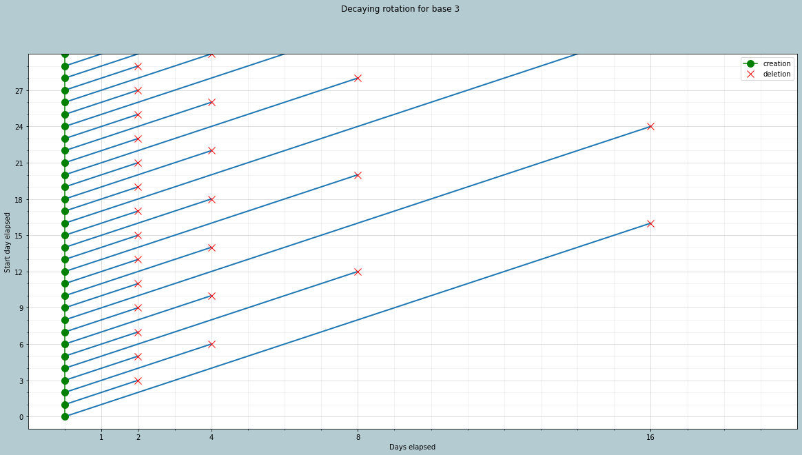
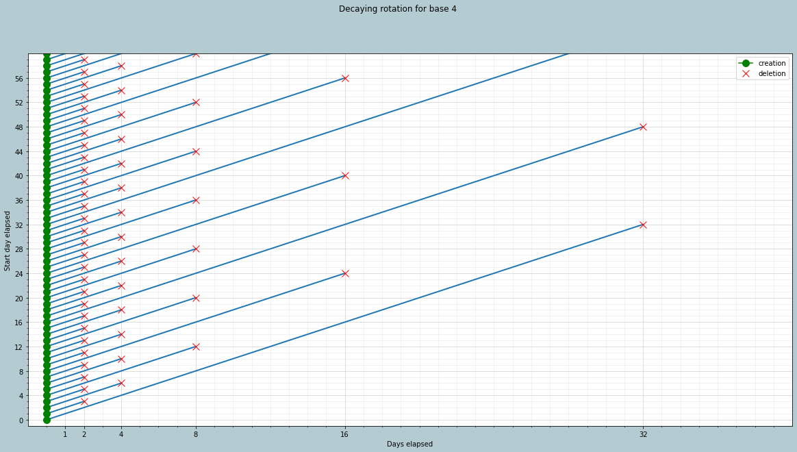

# Timebox

Timebox is a small tools that helps you backup your files or databases. The backups can either be stored locally, or on the cloud (thanks to the awesome [rclone](https://rclone.org/)).

Timebox aims to stay simple, straightforward, and unobtrusive. 
 - The backup files are stored as is, which means you don't need timebox to retrieve them (this also means no incremental backup).
 - It does not rely on any kind of database. All necessary metadata are stored in the filenames.

Implementation wise, the goal is to 
 - provide a wrapper around existing system commands.
 - provide an easily extensible system.

## Installation

The package is available on pypi.org under the name `backup-timebox`. Supported python versions are `3.7` and newer.

To install it, run `pip install backup-timebox`.

### External dependencies
 
Timebox relies on 
 - `bash` to combine commands with pipes.
 - [`rclone`]((https://rclone.org/)) for the [RCloneOutputProvider](/docs/providers.md#rcloneoutputprovider).
 - `pg_dump` for the [PostgresInputProvider](/docs/providers.md#rcloneoutputprovider)
 - Any other program you might want to use in the [CommandInputProvider](/docs/providers.md#commandinputprovider) or as a [PostOp](/docs/main.md#postop)

## Features comparison

Here's a feature comparison table with other open-source backup software:

|                                                     | Running mode        | Supported platforms   | Incremental backups |  Data source                   | Encryption | Integrated scheduler | Centralised configuration |
|----------------------------------------------------:|---------------------|-----------------------|---------------------|-------------------------------|------------|----------------------|---------------------------|
| timebox                                             | Cli program         | Linux                 |                ❌ No | Local data, custom commands   | ✅ Yes      | ❌ No                 | ✅ Yes                     |
| [blackbox](https://github.com/lemonsaurus/blackbox) | Cli program         | Linux                 | ❌ No                | Local data, various databases | ❌ No       | ❌ No                 | ✅ Yes                     |
| [duplicati](https://github.com/duplicati/duplicati) | Web server/ui + Cli | Linux, MacOS, Windows | ✅ Yes               | Local data                    | ✅ Yes      | ✅ Yes                | ✅ Yes                     |
| [restic](https://github.com/restic/restic)          | Cli program         | Linux, MacOS, Windows | ✅ Yes               | Local data, stdin             | ✅ Yes      | ❌ No                 | ❌ No                      |

**Notes**:
 - Supported storage backends is not included here, because there are so many of them, and also `rclone` does an amazing job of taking that burden away anyway.
 - The main difference `timebox` has with other backup managers is how *flexible* it is considering datasources, and post-operations, such as compression and encryption, by allowing to reuse existing programs.
 - Incremental backups is most useful if you want to backup big directories.


## How to use

### Configuration

In order to use timebox, you will need to write a `yaml` configuration file. Here's an example configuration of such file:

```yaml
backups:
  my_db:
    input:
      type: postgres
      username: user
      database: my_db
      password: DB_PWD
    outputs:
      - type: folder
        path: /data/backups
    rotation:
      type: simple
      days: 30
    post_ops:
      - compress
config:
  secrets_file: .secrets
  notification:
    type: webhook
    method: Post
    url: https://discord.com/api/channels/908MYCHANNEL458/messages
    secret: DISCORD_BOT_TOKEN
    headers:
      Authorization: Bot <SECRET>
    body:
      content: |
        **<SUMMARY>**

        <MESSAGE>
  post_ops:
    compress:
      command: [xz]
      extension: xz
```

Here you can see a configuration with a single backup. 
 - It takes as input a postgres database.
 - The database dump will be compressed using the `xz` command.
 - It has a single output, the local `/data/backups` folder.
 - Files will be kept for 30 days.
 - the file `.secrets` will be read to fetch sensitive values (`DB_PWD` and `DISCORD_BOT_TOKEN`)
 - once the backup is done, the webhook will be triggerd, posting a message on discord

The `.secrets` file is parsed with the [`python-dotenv`](https://pypi.org/project/python-dotenv/) package; it's content could be e.g. 
```
DB_PWD=my_very_long_db_pwd
DISCORD_BOT_TOKEN=ThISISnotAreaLToKENacR9SPLUiXfo4mMHwVn2IR4Kv208O8tZ2q
```

See also:
- **[the config file documentation](/docs/main.md)**
- **[the providers documentation](/docs/providers.md)**

### Execution

Timebox expects to be called daily for performing backups: `timebox -c /path/to/config.yaml run`.

You can also list files stored on the configured outputs:  `timebox -c /path/to/config.yaml ls`.

**Note***: the `rclone` output provider expects `rclone` to be already installed and configured.

Secret values will be fetched from the (optional) `secrets_file`, as well as from environment variables.

# Why another backup manager ?

I had a somewhat specific requirement, "decaying rotation" (more on that below), and none of the tools I found had exactly what I was looking for.

This project's name took inspiration from [blackbox](https://github.com/lemonsaurus/blackbox), another backup manager written in Python.


## Decaying rotation

The idea around decaying rotation is to keep a minimal number of backups, while keeping a long backup period. To do so, we have to keep some backups for a long time, while other will be short lived. This might be especially useful when performing a backup of personal files, where you might realise you have deleted something useful only a long time after the deletion has occured.

### Implementation

The method I found out was in fact the same as the [Tower of Hanoi roation scheme](https://en.wikipedia.org/wiki/Backup_rotation_scheme#Tower_of_Hanoi) (with some twists).

The specific implementation takes as input a `base`:

 - Each *2<sup>base</sup>* days, a new backup with a lifetime of *2<sup>base+1</sup>* days will be created.
 - Between two such backups, a new backup with a lifetime of *2<sup>base</sup>* days will be created.
 - We keep on creating backups in the remainging intervals, each time dividing the backup lifetime by two.
 
The following plots, computed for base 3 and 4, should give you a good idea of what is going on:

| base 3 | base 4 |
| ------------- |:-------------:|
|  |  |

This gives us a rotation strategy with the following property:
 
- For each *0 <= i <= base*, we have exactly **one** ([sometimes two?](https://xkcd.com/2248/)) backup that is between *2<sup>i</sup>* and *2<sup>i+1</sup>* days old.
- At all time, you have exactly *(base + 2)* backup files.

To give a practical example, you can have backups that span at least 256 days (and at most 512), while having only 10 backup files !

# Roadmap

 - [x] Add a "days" / "weeks" / "months" / "years" rotation provider.
 - [ ] Add alert mechanism on space usage.
 - [ ] Add a way to retrieve backups locally.
   - Need a "reverse" command for transformers.
 - [ ] Host rclone configuration in config file.
